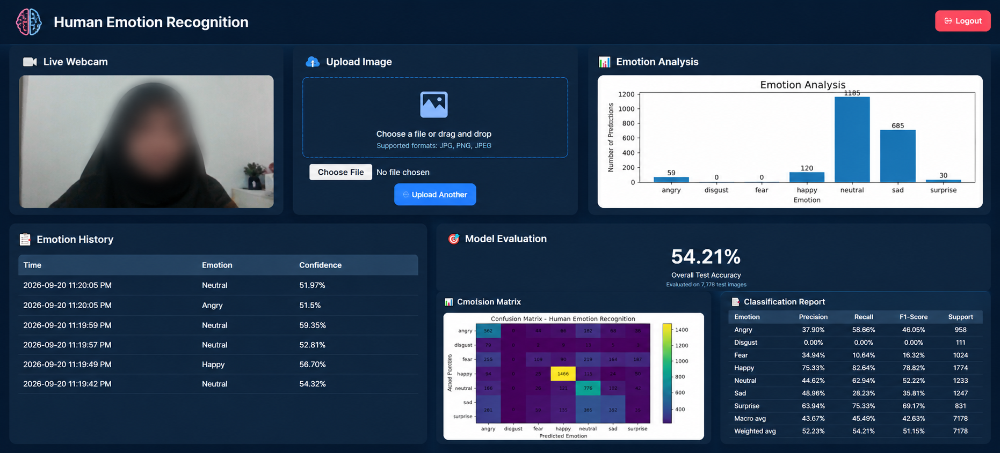

# Human Emotion Recognition Using CNN


## Project Overview

**Human Emotion Recognition Using CNN** is an AI-based facial emotion recognition system that detects human faces and classifies facial expressions into seven different emotion categories.

The system uses a **Convolutional Neural Network (CNN)** trained on the **FER-2013 dataset**. It provides both real-time emotion recognition through a webcam and emotion prediction from uploaded images.

A **Flask-based web dashboard** is used to provide an interactive interface for login, live webcam detection, image upload, emotion confidence, emotion history, training graphs, emotion analysis, model evaluation, confusion matrix, and classification report.

## Project Screenshot



## Objectives

* Develop a CNN-based human emotion recognition system.
* Recognize seven different human emotions.
* Detect faces in real time using a webcam.
* Predict emotions from uploaded images.
* Display prediction confidence percentage.
* Store emotion predictions in an emotion history.
* Display emotion analysis using a graph.
* Display training accuracy and training loss graphs.
* Evaluate the trained model using test accuracy.
* Display a confusion matrix and classification report.
* Provide an easy-to-use Flask web dashboard.

## Emotion Classes

The system recognizes the following seven emotions:

1. Angry
2. Disgust
3. Fear
4. Happy
5. Neutral
6. Sad
7. Surprise

## Dataset

The project uses the **FER-2013 (Facial Expression Recognition 2013)** dataset.

* Total Images: **35,887**
* Training Images: **28,709**
* Test Images: **7,178**
* Image Size: **48 × 48 pixels**
* Image Type: **Grayscale**
* Emotion Classes: **7**

## CNN Model

The system uses a **Convolutional Neural Network (CNN)** to classify facial expressions.

### Model Architecture

```text
Input: 48 × 48 × 1 Grayscale Image

        ↓

Conv2D (32 filters)
+ Batch Normalization
+ Max Pooling
+ Dropout

        ↓

Conv2D (64 filters)
+ Batch Normalization
+ Max Pooling
+ Dropout

        ↓

Conv2D (128 filters)
+ Batch Normalization
+ Max Pooling
+ Dropout

        ↓

Conv2D (128 filters)
+ Batch Normalization
+ Max Pooling
+ Dropout

        ↓

Global Average Pooling

        ↓

Dense (128 neurons)
+ Dropout

        ↓

Softmax Output
(7 Emotions)
```

### Model Details

* Model Type: **Convolutional Neural Network (CNN)**
* Input Size: **48 × 48 × 1**
* Output Classes: **7**
* Optimizer: **Adam**
* Learning Rate: **0.001**
* Total Parameters: **259,079**
* Model File: **emotion_model.keras**

## Technologies Used

* Python 3.11
* TensorFlow 2.21
* Keras
* OpenCV
* NumPy
* Pandas
* Matplotlib
* Scikit-learn
* Flask
* HTML
* CSS

## System Features

### 🔐 User Login

The system includes a login page to protect access to the main dashboard.

The current demo credentials are:

```text
Username: iqra
Password: iqra@123
```

### 📷 Live Webcam Emotion Recognition

The system uses the computer webcam to detect faces and recognize emotions in real time.

For each detected person, the system displays:

* Person number
* Detected emotion
* Confidence percentage

The webcam supports **multiple face detection**.

### 🖼️ Image Upload

Users can upload an image through the dashboard.

Supported image formats include:

* JPG
* JPEG
* PNG

The uploaded image is processed by the CNN model and the predicted emotion and confidence are displayed.

### 📊 Emotion Confidence

For every prediction, the system calculates a confidence percentage based on the CNN prediction probability.

Example:

```text
HAPPY (85.4%)
```

### 📋 Emotion History

The system stores detected emotions in:

```text
emotion_history.csv
```

The dashboard displays the latest five recorded predictions with:

* Time
* Emotion
* Confidence

### 📈 Emotion Analysis

The system creates an **Emotion Analysis** bar graph based on the stored emotion history.

The graph shows the number of predictions recorded for each emotion.

### 📈 Training Accuracy Graph

The system reads the training information from:

```text
training_history.json
```

The dashboard displays:

* Training Accuracy
* Validation Accuracy

over the training epochs.

### 📉 Training Loss Graph

The dashboard also displays:

* Training Loss
* Validation Loss

over the training epochs.

### 🎯 Model Evaluation

The dashboard displays the overall test accuracy of the trained CNN model.

The current project test accuracy is approximately:

**54.21%**

The evaluation is based on:

**7,178 test images**

### 📊 Confusion Matrix

The system displays a confusion matrix generated during model evaluation.

The confusion matrix helps visualize how the model's predictions compare with the actual emotion classes.

### 📑 Classification Report

The dashboard displays the classification report containing:

* Precision
* Recall
* F1-Score
* Support

for each emotion class.

## Dashboard Structure

The Flask dashboard contains the following sections:

```text
Login
   ↓
Dashboard
   ├── Live Webcam
   ├── Upload Image
   ├── Training Accuracy
   ├── Training Loss
   ├── Emotion History
   ├── Emotion Analysis
   ├── Overall Test Accuracy
   ├── Confusion Matrix
   └── Classification Report
```

## System Workflow

The complete system works through the following steps:

```text
Webcam / Image Upload
          ↓
      Face Detection
          ↓
    Grayscale Conversion
          ↓
      Resize to 48 × 48
          ↓
       Normalization
          ↓
      CNN Processing
          ↓
   Emotion Probability
          ↓
 Highest Probability Emotion
          ↓
 Emotion + Confidence
          ↓
   Save Emotion History
          ↓
 Dashboard Visualization
```

## Webcam Prediction Process

For webcam detection, the system uses a short prediction history for each detected face.

The recent predictions are averaged before selecting the final emotion. This helps make the live emotion output more stable instead of changing rapidly between emotions.

The system also records webcam predictions approximately every two seconds for each detected face.

## Image Prediction Process

For uploaded images, the system performs the following steps:

1. Save the uploaded image.
2. Read the image using OpenCV.
3. Convert the image to grayscale.
4. Resize it to **48 × 48 pixels**.
5. Normalize pixel values.
6. Prepare the image for CNN input.
7. Generate the emotion prediction.
8. Select the emotion with the highest probability.
9. Calculate the confidence percentage.
10. Save the prediction to emotion history.
11. Display the emotion and confidence on the image.

## Project Files

Important project files include:

```text
human-emotion-recognition-CNN/
│
├── app.py
├── train.py
├── emotion_model.keras
├── emotion_history.csv
├── classification_report.csv
├── confusion_matrix.png
├── training_history.json
├── training_accuracy.png
├── uploads/
│
├── templates/
│
└── README.md
```

> The exact files in the repository may vary depending on the current project version.

## Model Results

The trained CNN model was evaluated using **7,178 test images**.

### Test Accuracy

**54.21%**

The model evaluation includes:

* Accuracy
* Precision
* Recall
* F1-Score
* Confusion Matrix
* Classification Report

The results show that the model is able to recognize facial expressions, although some emotions can be difficult to distinguish because different emotions may have similar facial characteristics.

## Limitations

* The model is trained using the FER-2013 dataset, which contains variations in image quality, lighting, facial expressions, and face angles.
* The current model achieves approximately 54% test accuracy, so some predictions may be incorrect.
* Webcam predictions can be affected by poor lighting, camera quality, face angle, and partial face visibility.
* Similar facial expressions can sometimes be difficult for the model to distinguish.
* The uploaded-image prediction currently processes the uploaded image as a facial input and does not perform the same face-detection pipeline used by the webcam.
* The system is developed for academic and educational purposes and should not be used for medical or psychological diagnosis.

## Future Improvements

Future versions of the project could include:

* Improving CNN model accuracy.
* Using advanced CNN architectures.
* Applying transfer learning.
* Using a larger and more balanced dataset.
* Improving data augmentation techniques.
* Improving face detection and face tracking.
* Improving real-time prediction performance.
* Adding more emotion categories.
* Developing a mobile application.
* Deploying the system as an online web application.
* Adding user-specific prediction history.
* Adding additional visualization and analytics features.

## License

This project was developed for **academic and educational purposes**.

## Author

**Iqra Raheem**

Human Emotion Recognition Using CNN
